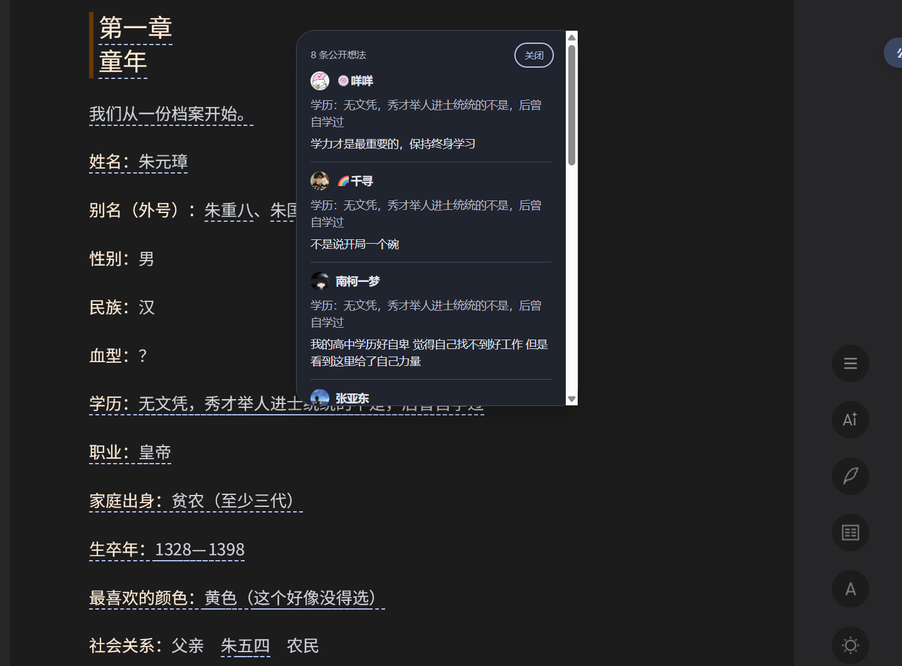

# I1 · 纵向上下文与模式隔离

日期：2026-10-10。本轮仅修正 I1；I2 操作栏及 I3 点赞／回复未接入，已发布版本仍为 v1.4.0-beta.1。

## 交付范围

插件增强仅用于上下滚动页面。左右双栏用来参考官方行为，不提供插件 UI 或插件评论加载。

- 删除此前的 `horizontalReaderAdapter.js` 及横向映射路径；横向 bridge 返回 `READING_MODE_DISABLED`，交互上下文为空，不观察其选区方法或读取双页内容。
- 使用原生模式控件与 Reader 能力识别模式。未确定为纵向时不挂载；模式探测只读，不调用复制、写入或编辑器入口。
- 纵向会话拥有独立 React root、观察器、监听器、同步计时器及 AbortController；退出时卸载 UI、解除会话监听、取消评论请求、清理划线／popup／索引及侧栏布局 class。
- 在请求前后校验会话与模式；过期会话不能渲染，新会话不复用旧回调。切回纵向仅恢复一次，侧栏开关、密度和排序设置保留。
- Reader 替换、切书、切章、字号和窗口变化清理旧定位或选区；切书重新绑定评论会话，切章不保留上一章的 READY 诊断状态。
- `GET_READER_INTERACTION_CONTEXT` 在纵向提供公共书籍／章节、原生 range 与选区文本；跨章、非安全 offset、旧布局或销毁实例均返回空选区。观察原生方法时保留参数、返回值与属性描述符。

横向仍保留一个轻量模式检测通道，以便识别返回纵向；它不挂载插件内容、不加载插件评论、不进行横向 range 映射。微信读书官方自身的请求与 UI 继续正常工作。

## 自动化验收

`npm run test:acceptance` 通过，使用独立临时 profile 和完整路由拦截，不读取真实账户：

| 检查 | 结果 |
| --- | --- |
| 离线测试 | 45 项通过；覆盖只读模式识别、纵向选区、失效／销毁／描述符恢复、横向拒绝映射、AbortSignal 取消 |
| TypeScript／生产构建 | 通过 |
| M4 兼容性夹具 | 7 项通过 |
| M5 UI／生命周期／性能夹具 | 15 项通过；800 条评论仍按 2 个 range、1 个 batch 映射，稳定滚动无新增映射或评论请求 |
| 修正版 I1 夹具 | 6 项通过：初始横向零插件内容和请求；纵向恢复与 popup；选区／字号／缩放／稳定缓存；慢请求退出；重复切换；纵向同页切书 |

I1 夹具验证横向原生方法不被替换、官方按钮继续响应。慢请求退出后不会继续旧章分页，响应迟到不会重建 UI；连续切换三轮无重复 root 或启动按钮。报告存于忽略的 `.test-artifacts/i1-vertical`。

## 本地真实登录态验收

用提升权限的 `exec_command` 启动 Windows 桌面可见的 headed Playwright Chromium，沿用用户已扫码的本地测试 profile。主要在《明朝那些事儿（全集）》上下滚动模式验收；没有执行个人划线写入、复制、发布、回复、点赞或 AI 提问。

| 场景 | 结果 |
| --- | --- |
| 纵向评论定位 | 第一章 382，接口返回 492 条公开评论，166 组 range 定位成功，兼容状态 READY；数量仅指当次接口返回 |
| 侧栏关闭 | 正文划线与评论 popup 正常，可用 Escape 关闭；插件风格与现有版本一致 |
| 真实鼠标选区 | 返回书籍 822995、章节 382、range 2036–2044、原文「大凡皇帝出世，后」；原生选择工具栏保留 |
| 窗口变化 | 1440×1000 → 1300×900 后旧选区清空，重新定位仍 READY；随后恢复窗口尺寸 |
| 原生字号 | level 2 → 3 后重新排版及清空旧上下文，随后恢复 level 2 |
| 原生目录切章 | 382 → 383 时旧章划线清除、上下文更新；验收后返回 382 |
| 模式退出检查 | 切入双栏后插件侧栏、启动按钮、划线层、popup 均为零，侧栏布局 class 撤去，交互上下文为空 |
| 请求归属检查 | Network initiator 区分官方与扩展：退出期间没有扩展 `contentScript` 发起的评论请求，官方请求未拦截；回到纵向能观察到扩展正常加载 |
| 返回纵向 | 恢复一个插件 root，先前关闭侧栏的设置保留，评论定位正常 |

真实页面截图仅用于展示纵向原有评论 UI，未加入 I2 操作按钮：

旧横向实验资料保留为历史记录，不再作为交付或发布依据。此轮没有变更扩展权限、版本号或发布 Release。
