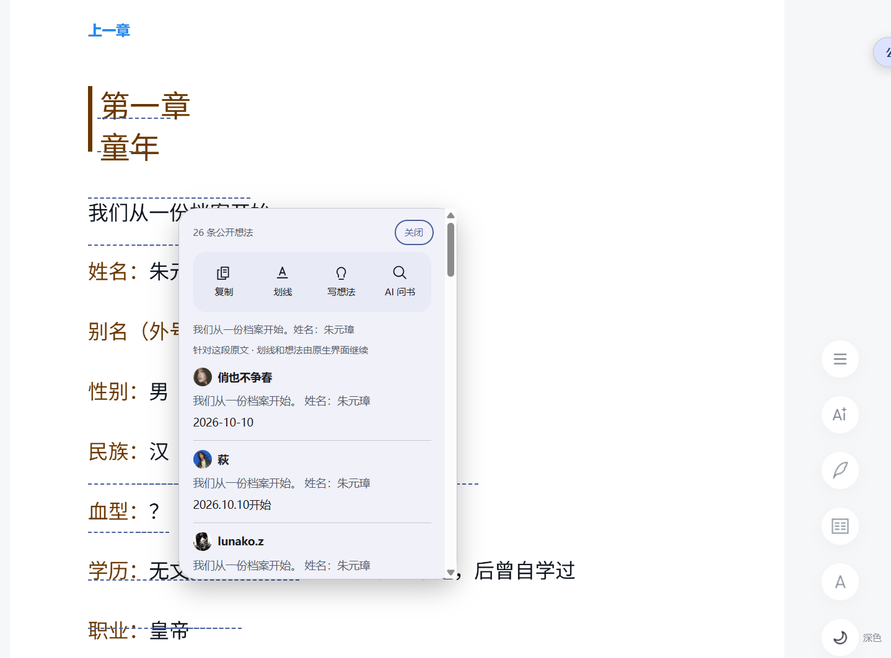
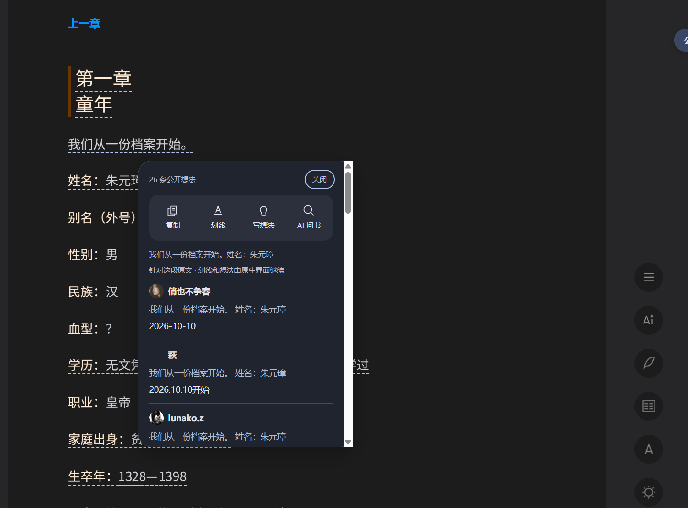

# I2 · 纵向原文操作栏

日期：2026-10-10。本阶段仅实现上下滚动页面 popup 的原文操作；I3 点赞／回复和 M6 发布准备未开始。

## 成品效果

关闭侧栏后，点击公开评论划线或 badge 即可使用原文操作。沿用现有配色、圆角及日夜主题，390px 窗口排成两列。原文预览最多两行，操作使用完整原文；评论仍保持完整正文。

[真实窄窗口截图](previews/i2-vertical-narrow.png)。图片来自 Windows 桌面可见的 Playwright Chromium 登录态真实页面。

| 入口 | 行为 |
| --- | --- |
| 复制 | 原生正文对象提供文本，执行前再次校验上下文；通过 Clipboard API 复制，成功或失败均有反馈 |
| 划线 | 精确原文对象和原生 rect 传给 `showSelectionToolBar`；官方通过 `getNoteInObjsRange` 检查已有个人划线，由用户选择样式或删除；插件入口本身不写入 |
| 写想法 | 原文对象传给 `showWriteReviewPanel`，打开空白原生编辑器并获得输入焦点；公开／私密及提交仍由原生编辑器处理 |
| AI 问书 | 完整原文传给 `showAiChatPanel`；当前页面预填官方输入框并获得焦点，不自动发送提问 |

核对了当前[官方 Reader 脚本](https://cdn.weread.qq.com/web/wrwebnjlogic/js/9.f252b488.js)，并验证真实调用。它们是内部实现，不是稳定公开 API；方法缺失、登录失效或 AI 明确被禁用时按单项降级。

## 上下文与失败处理

- 准备操作必须匹配当前插件会话书籍、章节和原生 range；对象起止 offset 必须完整对应同一 range。文本来自 Reader，不取评论内容或接口 abstract。
- 原生对象仅留在 page bridge，popup 持有操作句柄、原文和能力状态。执行时再次核对 Reader 实例、书籍、章节、模式、布局签名与版本。
- 同时最多执行一个命令；打开原生工具后不重复调用。失败不自动重试，也不宣称写入成功，避免副作用不确定时重复执行。
- popup 关闭后的迟到响应不重建 UI。切章、布局失效和退出纵向复用 I1 清理；横向没有插件操作栏、评论 UI 或映射。
- 准备原文复用有效的正文缓存；稳定滚动不执行命令、不新增评论请求或映射。未增加扩展权限、依赖或直接写接口。

## 自动化验收

`npm run test:acceptance` 全部通过：

| 项目 | 结果 |
| --- | --- |
| 离线测试 | 51 项通过，含原文核实、书籍／章节／模式／布局／实例失效、命令参数、单项能力及登录失效、重复点击和失败不重试 |
| 类型检查与生产构建 | 通过 |
| M4 Chromium | 7 项通过 |
| M5 Chromium | 15 项通过 |
| I1 Chromium | 6 项通过 |
| I2 Chromium | 9 项通过 |

I2 夹具覆盖侧栏关闭、键盘复制、原生工具与编辑器参数、AI 传文、单项降级、过期句柄、失败不重试、重复点击和迟到结果、窄窗口日夜主题、无法核实原文及横向退出。接口全部路由拦截，不读取真实账户；写请求为零。报告保存在忽略的 `.test-artifacts/i2`。

## 真实登录态验收

通过提升权限的 `exec_command` 启动桌面可见的 headed Playwright Chromium，沿用用户已扫码的本地 profile，在《明朝那些事儿（全集）》第一章上下滚动模式检查，未导出登录凭据。

| 检查 | 结果 |
| --- | --- |
| 原文核实 | “我们从一份档案开始。姓名：朱元璋”来自原生正文，四个入口可用 |
| 复制 | 实际复制内容与原文逐字一致，提示正常 |
| 划线 | 打开官方“复制／马克笔／波浪线／直线／写想法／AI问书”工具；未点击样式写入按钮 |
| 写想法 | 打开空白编辑器，焦点为 `writeReview_textarea`；未输入或发表 |
| AI 问书 | 原文预填官方输入框，焦点为 `readerAIChatPanel_footer_textarea`；未发送提问 |
| 主题与窄窗口 | 日夜正常；390×800 中排成两列，popup 横向边界 12–372px，无横向溢出，侧栏保持关闭 |
| 模式边界 | 双栏插件节点为零；回到纵向恢复一个 root，侧栏关闭设置保留 |

本次真实验收证明原文传递与原生入口正常，未测试实际个人划线写入／删除、发表结果或 AI 生成结果；这些由用户在原生界面继续操作，不将模拟成功当成真实写入成功。官方对象或入口变化时，应重新核实并降级对应按钮。

版本号及已发布安装包未变，本阶段未发布 Release。
