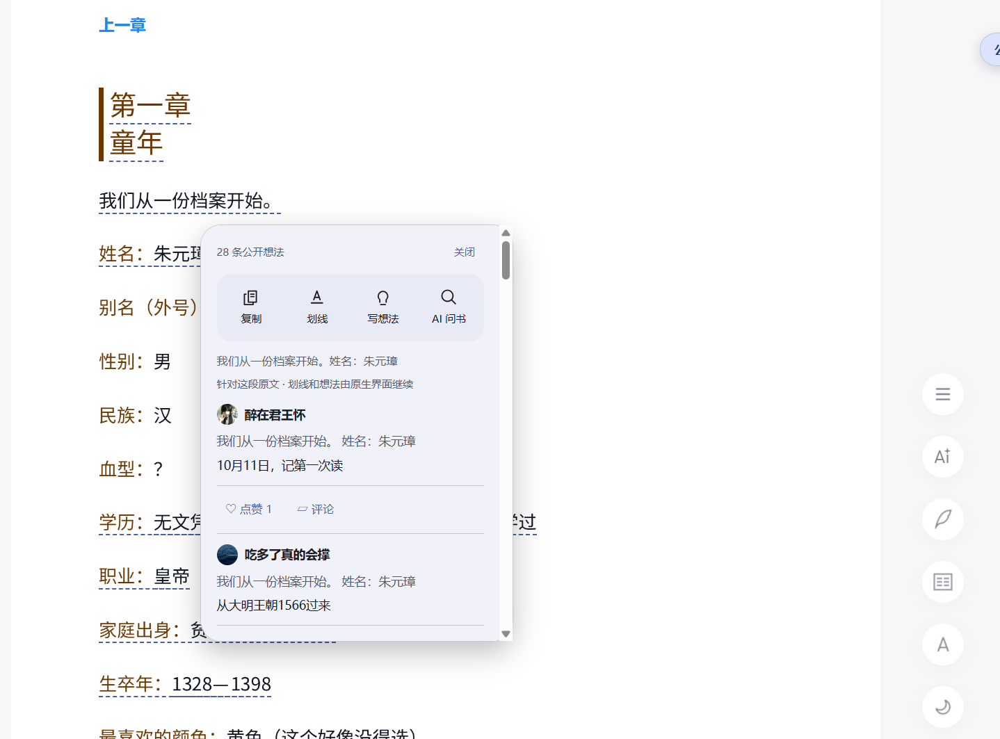
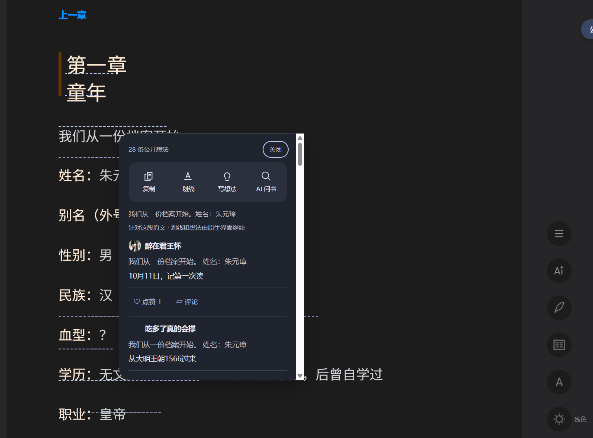

# I3 · 纵向想法点赞与评论

日期：2026-10-11。仅增强上下滚动页面的插件卡片，沿用现有 UI 风格。I4 和 M6 未开始，版本仍为 `1.4.0-beta.1`，本阶段没有发布安装版。

## 成品效果

侧栏关闭时，popup 仍独立提供原文操作栏和每条想法的互动按钮。点赞针对该卡片的想法；“评论”打开它的原生详情和空白回复输入框，与顶部针对原文的“写想法”分别处理。

图片来自 Windows 桌面可见的 Playwright Chromium、真实登录态上下滚动 Reader，未模拟接口响应。未点击真实点赞，未提交回复。

## 实现与边界

- 侧栏和 popup 共享按 `reviewId` 存储的互动状态。数字由服务端提供；未知点赞状态先只读同步，未知回复数不显示为零。筛选、排序、引用展开和密度逻辑保持原有行为。
- 注册目标来自已加载的公开章节列表。操作前读取单条公开想法，核实 ID、书籍、章节、公开性、登录态和当前纵向 Reader；过期会话拒绝执行。原生条目和 Reader 对象留在 page bridge，内容脚本只接收状态。
- 点赞使用当前 Reader 已注册且唯一匹配的 `FETCH_REVIEW_LIKE` 原生 Vuex action，参数为 `{ reviewId, isUnlike }`。不使用固定 webpack 模块编号；返回成功后再只读校准状态和数量。若新读到的本人点赞状态已变化，先更新按钮，本次不反向写入。
- 每条想法的请求进行中禁止重复点击。失败、结果不明确、已提交但校准失败分别提示，保留原显示状态，提供手动只读刷新，不自动重复写入。切章后的实际写入不能撤销，迟到结果不会更新新章或重建旧 popup。
- 纵向原生详情位于 `ReaderNotePanel` 的 `reviewDetail` 中。先检测角色与方法，必要时打开父容器，再调用详情 `show({ review: entry, showComment: true })`；检查可见性，避免把隐藏组件调用成功误判为可见入口成功。已有非空原生回复或提交中的编辑器不会被覆盖。
- 原生详情负责回复列表、分页和提交；插件没有回复写接口或自动提交。关闭详情后只读同步该想法状态，再恢复原卡片按钮焦点；父容器仅在由插件打开且仍属于本次目标时关闭。
- 单项入口缺失或登录失效有提示，读取评论与其他可用操作继续工作。进入左右双栏时清理插件会话和 UI；不在那里制作增强或覆盖官方工具。
- 稳定滚动、列表打开与能力探测不执行写操作，不批量读取每条详情。没有增加扩展权限、依赖或凭据导出。

核实资料为当前真实页面加载的 Reader 与原生 action 脚本，以及只读单条公开想法响应。它们是网站内部实现，后续更新仍可能导致某项能力降级，不能视为稳定公开 API。

## 受控验收

`npm run test:acceptance` 包含以下项目：

| 项目 | 结果 |
| --- | --- |
| 离线测试 | 59 项通过，新增 8 项互动适配测试 |
| TypeScript 与生产构建 | 通过 |
| M4／M5 Chromium | 7／15 项通过 |
| I1／I2 Chromium | 6／9 项通过 |
| I3 Chromium | 11 项通过 |

I3 夹具覆盖只读列表与滚动、未知数值、正确目标点赞／取消点赞、共享 UI 状态、并发点击、服务端状态变化、拒绝及校准失败、显式回复提交与分页、详情父容器与关闭焦点、窄窗口和日夜主题、反复 popup 开关、迟到写响应、能力丢失与横向退出。受控请求全部路由到本地模拟响应，写操作不接触真实账户。报告位于忽略的 `.test-artifacts/i3`；800 条评论的 M5 稳定滚动检查仍要求零新增映射与评论请求。

## 真实登录态验收

沿用提升权限 `exec_command` 启动 headed Playwright Chromium，复用本地用户扫码登录的浏览器。在《明朝那些事儿（全集）》的纵向章节中验证：

- 关闭插件侧栏后，公开划线 popup 的卡片互动仍可用；日间、夜间显示正常。
- 两条不同想法的“评论”入口分别打开对应原生详情；回复框为空且获得焦点，没有带入评论正文或替用户提交。
- 原生关闭按钮关闭详情及插件打开的父容器，popup 保留，焦点返回原卡片的评论按钮。先刷新状态再恢复焦点，避免刷新过程中禁用按钮导致失焦。
- 观察期间没有 `/web/review/like`、`/web/review/comment` 或 `/web/review/add` 写请求，没有导出 cookies、token 或 storageState。

用户明确选择“先只验收详情与回复入口”。因此真实账号点赞／取消点赞、回复最终提交及真实回复分页尚未验收；受控成功不等于真实写入成功。后续由用户指定公开想法并授权点赞后取消，回复则由用户在原生编辑器显式提交，再核对服务端状态。I4 与发布前需保留此项待验收记录。
