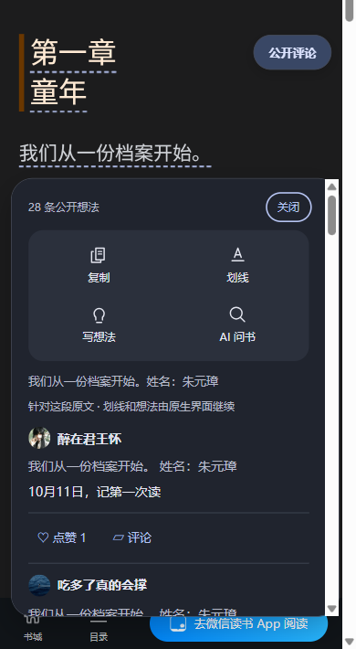

# I4 · 互动回归与交互改进

日期：2026-10-11。开发与受控验收完成，真实纵向入口回归通过。范围仅为上下滚动插件增强，保留现有 Material You 风格及原生编辑器。没有升级版本、推送 GitHub 或发布 Release；M6 仍待开始。

## 改进内容

- 互动订阅按想法 ID 分组。点赞、刷新与回复反馈仅通知对应想法在侧栏和 popup 中的组件；章节整体初始化／清理仍通知全部组件。注册去重使用 Set，避免大量卡片下逐条扫描 ID 列表。
- 登录失效或某项原生能力缺失时，保留“刷新状态”入口。用户登录或能力恢复后手动只读刷新，即可重新检测这条想法的点赞和回复能力，不必重新加载全章。刷新不执行点赞或回复提交。
- 退出会话时释放内容脚本中的旧等待与超时计时器，忽略旧响应；原生已发出的写入及锁继续保留到完成，不宣称取消写入。即使迟到结果返回 stale，按钮也不会无限停留在等待状态，而是提示上下文变化。
- 不同想法同时打开回复时串行保护原生详情。父容器打开、下一次渲染及详情显示后的各个异步阶段均复查上下文；失败或过期时清理插件拥有的容器，避免出现空白父面板或旧章详情。
- 已有非空回复草稿与提交中的原生编辑器不被覆盖。详情关闭后只读同步，再返回原按钮焦点；原生编辑与提交仍由用户操作。

## 自动化结果

`npm run test:acceptance` 全部通过，最终进程退出码为 0。

| 验收 | 结果 |
| --- | --- |
| 离线测试 | 66 项通过，新增 7 项 I4 状态、超时、锁与生命周期回归 |
| TypeScript、生产构建 | 通过 |
| M4／M5 Chromium | 7／15 项通过 |
| I1／I2／I3 Chromium | 6／9／11 项通过 |
| I4 Chromium | 8 项通过 |

新增 Chromium 场景：登录恢复、800 条卡片的目标更新、未提交草稿保护、能力恢复、慢详情读取后切章、反复开关 popup、稳定滚动／主题变化，以及原生详情打开时退出纵向并恢复。所有请求均被受控夹具路由，只有模拟服务端接收写入；无真实账号或凭据读取。

800 条卡片同时在侧栏与 popup 中显示时，一次点赞仅修改目标想法的两行，其他卡片无 DOM 变更；本机该次互动约 81ms，回归上限为 5 秒。这是本机受控结果，不保证真实接口延迟。稳定滚动的新增映射、评论列表请求、详情读取和写入均为零。反复开关后，一次详情打开只产生一次单条读取，关闭只产生一次状态读取。结果存放在忽略的 `.test-artifacts/i4/report.json`。

## 真实纵向页面回归

使用提升权限启动的 Windows 桌面 headed Playwright Chromium，复用用户已扫码登录的本地测试浏览器，在《明朝那些事儿（全集）》上下滚动章节复核：

- 侧栏关闭，键盘 Enter 打开卡片的原生回复入口；原生详情可见，输入框为空且获得焦点。
- 原生关闭后父容器收起，popup 保留，焦点返回评论按钮。
- 连续三次开关 popup、窗口缩到 390px 后正常显示；popup 左右边界为 12／372px，原文工具栏换为两列，卡片互动可见。
- 上述交互及缩放观察期间新增评论列表请求为零，未发出点赞或回复写请求；未导出 cookies、token 或 storageState。

用户已确认 I3 浏览器效果中“点赞可以，回复也能打开官方的评论页面”。此结论作为用户本地确认记录；代理本轮继续只复核入口，没有代为点赞或发布。

## M6 前待复核

回复最终提交、真实回复分页以及点赞／取消点赞的完整服务端往返，仍需本地手工验证。由用户指定公开想法并授权相应操作；回复由用户在原生编辑器中确认提交，再刷新核对状态。既有自动化、入口验收和用户效果确认不能替代这些真实写入验证。M6 继续负责版本、截图、权限、安装包与发布准备。
